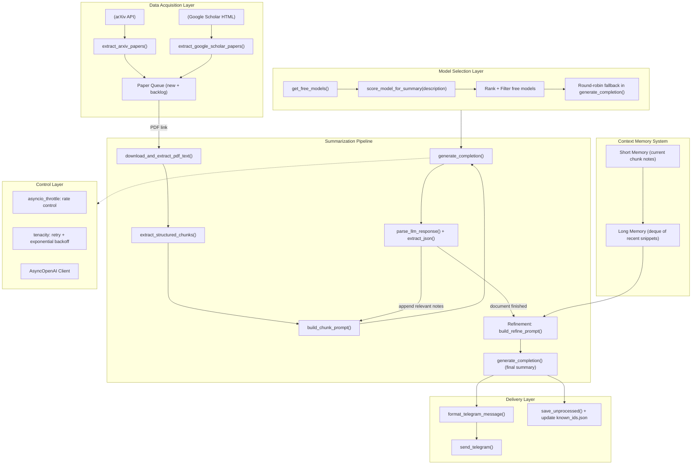

# Daily Paper Automation

This project automates the process of extracting, summarizing, and sending research papers from sources like Google Scholar and arXiv. It uses `asyncio` for concurrency, `aiohttp` for asynchronous HTTP requests, and OpenAI APIs for summarization.

## Features

- **Google Scholar and arXiv Integration**: Extracts research papers based on specified queries.
- **PDF Text Extraction**: Downloads and extracts text from PDF files.
- **Summarization**: Summarizes extracted text using OpenAI's API.
- **Telegram Notifications**: Sends formatted paper summaries to a Telegram chat.
- **Rate Limiting**: Uses `asyncio-throttle` to control request rates.

## Requirements

- Python 3.8+
- Dependencies listed in `requirements.txt`

## Installation

1. Clone the repository:
   ```bash
   git clone https://github.com/your-username/daily-paper.git
   cd daily-paper
   ```

2. Install dependencies:
   ```bash
   pip install -r requirements.txt
   ```

3. Set up environment variables:
   Create a `.env` file in the root directory with the following variables:
   ```
   tg_bot_token=YOUR_TELEGRAM_BOT_TOKEN
   chat_id=YOUR_TELEGRAM_CHAT_ID
   openrouter_key=YOUR_OPENAI_API_KEY
   api_base_url=YOUR_OPENAI_API_BASE_URL (optional)
   ```

## Framework




## Usage

1. Run the script:
   ```bash
   python scraping.py
   ```

2. The script will:
   - Fetch papers from Google Scholar or arXiv based on predefined queries.
   - Summarize the papers using OpenAI's API.
   - Send the summaries to a Telegram chat.

## Configuration

- **Queries**: Modify the `queries` list in the `main` function to customize search terms.
- **Rate Limits**: Adjust the `Throttler` settings for query, summary, and Telegram message sending rates.
- **Maximum Papers**: Change the `MAX_PAGE` and `MAX_IDS` constants to control the number of papers processed.

## File Structure

```
daily_paper/
├── scraping.py         # Main script for automation
├── .env                # Environment variables (not included in the repo)
├── .data/              # Folder for storing cached data
└── requirements.txt    # Python dependencies
```

## Dependencies

- `aiohttp`: For asynchronous HTTP requests.
- `asyncio-throttle`: For rate limiting.
- `tenacity`: For retrying failed API calls.
- `feedparser`: For parsing RSS feeds (arXiv).
- `python-dotenv`: For loading environment variables.
- `beautifulsoup4`: For parsing HTML (Google Scholar).
- `PyMuPDF`: For extracting text from PDFs.

## Notes

- Model selection uses:
• description keyword scoring
• free-only filter
• highest context length first
end

- Maintains continuity:
short-term chunk → deque long-term
→ contextual refinement summary

- Ensure that your OpenAI API key has sufficient quota for summarization tasks.

- The script uses a retry mechanism for handling API rate limits and timeouts.


end

## License

This project is licensed under the MIT License. See the `LICENSE` file for details.